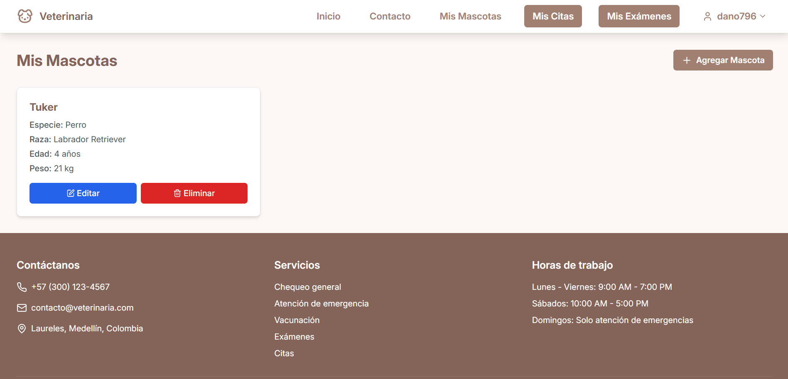

# Full-Stack Vet Project

Full Stack project for a web app that provides home veterinary services. The app allows users to register, manage pet information, book appointments or exams, make payments, and more.


## Technologies Used

### Backend

- **Language:** JavaScript
- **Framework:** Express.js
- **Database:** MySQL
- **Authentication:** JWT

### Frontend

- **Framework:** React + Vite
- **Language:** TypeScript
- **Styling:** Tailwind CSS

## Main Features

### User

- Registration and login.
- Management of pet information.



- Appointment booking for veterinary consultations.
- Viewing appointment history.


- Exam booking.
- Viewing exam history.

previews

- Service payments via credit card or cash (simulation).
- Contact section.


## Installation and Setup

### Backend

1. Clone the repository:
   ```sh
   git clone https://github.com/dano796/full-stack-veterinary.git
   cd backend
   ```
2. Install dependencies:
   ```sh
   npm install
   ```
3. Configure environment variables (.env).

4. Start the server:
   ```sh
   node app.js
   ```

### Frontend

1. Access the Frontend directory (assuming you already cloned the repository by following the steps before):
   ```sh
   cd frontend
   ```
2. Install dependencies:
   ```sh
   npm install
   ```
3. Start the development server:
   ```sh
   npm run dev
   ```
